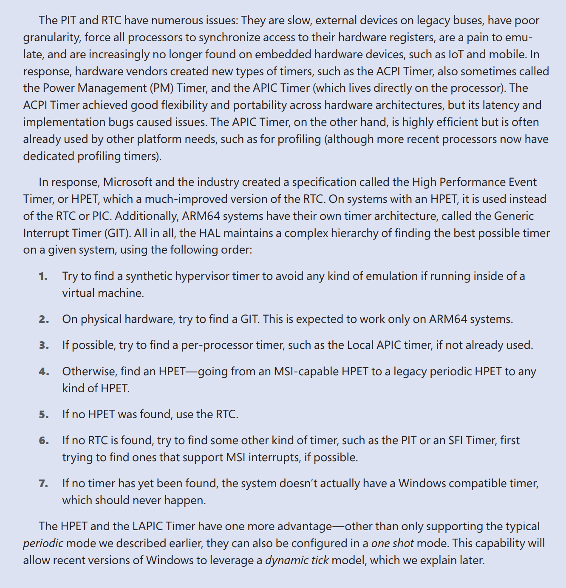

# Research on the usage of USEPLATFORMTICK

[Discord server where I do research](https://discord.gg/YdYVSBbZWY)

## 1. Initial Discovery and String Analysis

The only usage of USEPLATFORMTICK in the entire system was found by dumping all strings of system32 using [strings2.exe](https://github.com/glmcdona/strings2) and searching for USEPLATFORMTICK. No other code uses `USEPLATFORMTICK` besides ntoskrnl.exe and ntkrla57.exe.

```c
if ( strstr(v3, "USEPLATFORMTICK") )          // if bcdedit /set USEPLATFORMTICK yes
  HalpTimerPlatformClockSourceForced = 1;     // then we set HalpTimerPlatformClockSourceForced = 1, now we can look for references for HalpTimerPlatformClockSourceForced
```

## 2. Cross-Reference Analysis

The only cross-references to `HalpTimerPlatformClockSourceForced` are found in the function `HalpTimerFindIdealClockSource`.

We can use IDA plugins to analyze references to `HalpTimerFindIdealClockSource`:

```py
Python>import export_clean_xrefs
Python>import export_each_func
Python>export_clean_xrefs.export_xrefs_pseudocode('HalpTimerFindIdealClockSource', max_depth=10)
Python>export_each_func.export_xrefs_pseudocode('HalpTimerFindIdealClockSource', max_depth=10)
```

## 3. Control Flow Analysis

In `HalpTimerFindIdealClockSource` (link the file here), we can analyze the control flow:

If either `HalpHvCpuManager` or `HalpHvPresent` are false, then we jump to LABEL_7, where we then try to find this timer `Timer = (__int64)HalpFindTimer(11, 0x220, 0, 0x50, 0);`, whatever it might be. Once it finds a suitable timer, it then jumps to LABEL_26, assigns `v4 = *(_DWORD *)(Timer + 0xE0);` if then `(v4 & 0x50) != 0` then we `return Timer & -(__int64)((v4 & 0x20) != 0);`, I do not know what the second part is yet (`-(__int64)((v4 & 0x20) != 0)`).

### 3.1 Timer Assignment Flow

Now we can connect to our local kernel debugger and take a look at `HalpClockTimer` as that is essentially the same as the Timer we find in `HalpTimerFindIdealClockSource`.

[HalpTimerSelectRoles.c](HalpTimerFindIdealClockSource_xrefs/01_HalpTimerSelectRoles_1404f4b88.c#L47)
```c
IdealClockSource = HalpTimerFindIdealClockSource();     // The Timer we get from HalpTimerFindIdealClockSource()
v6 = IdealClockSource;                                  // the timer we found gets assigned to v6
if ( !IdealClockSource )
{
  HalpTimerLastProblem = 20;
  return 0xC0000001;
}
if ( (int)HalpTimerInitialize(IdealClockSource) >= 0 )
{
  *(_DWORD *)(v6 + 184) |= 4u;
  HalpClockTimer = v6;                                  // HalpClockTimer is now set to the timer we found
  goto LABEL_11;
}
```

## 4. Runtime Investigation with WinDbg

### 4.1 Verifying USEPLATFORMTICK Status

I currently have useplatformtick set to yes, as we can verify through WinDbg.

It can be seen with in WinDbg
```
lkd> db HalpTimerPlatformClockSourceForced l1
fffff803`eadc2558  01    
```
or it can be seen through the terminal with `bcdedit /enum {current}`
```
C:\Windows\System32>bcdedit /enum {current}

Windows Boot Loader
-------------------
...
debug                   Yes
useplatformtick         Yes
...
```

### 4.2 Clock Timer Structure Analysis

Now let's examine `HalpClockTimer` through WinDbg:
```
lkd> dq HalpClockTimer l1
fffff803`eadc2550  fffff7e0`80016000
```

After examining the local types in IDA, I found it has the structure of `_HAL_CLOCK_TIMER_CONFIGURATION`:

```
lkd> dt _HAL_CLOCK_TIMER_CONFIGURATION fffff7e0`80016000
nt!_HAL_CLOCK_TIMER_CONFIGURATION
   +0x000 Flags            : 0x80 ''
   +0x000 AlwaysOnTimer    : 0y0
   +0x000 HighLatency      : 0y0
   +0x000 PerCpuTimer      : 0y0
   +0x000 DynamicTickSupported : 0y0
   +0x004 KnownType        : 0xfffff803
   +0x008 Capabilities     : 0x80013be0
   +0x010 MaxIncrement     : 0x2710
   +0x018 MinIncrement     : 0
```

### 4.3 Timer Resolution Impact

By changing the system's timer resolution we can see that `MaxIncrement` changes from `0x2710` to `0x1388`. These values are stored in $100\text{ns}$ units, so `0x2710` equals **1 ms** and `0x1388` equals **0.5 ms**:
```
lkd> dt _HAL_CLOCK_TIMER_CONFIGURATION fffff7e0`80016000
nt!_HAL_CLOCK_TIMER_CONFIGURATION
   +0x000 Flags            : 0x80 ''
   +0x000 AlwaysOnTimer    : 0y0
   +0x000 HighLatency      : 0y0
   +0x000 PerCpuTimer      : 0y0
   +0x000 DynamicTickSupported : 0y0
   +0x004 KnownType        : 0xfffff803
   +0x008 Capabilities     : 0x80013be0
   +0x010 MaxIncrement     : 0x1388
   +0x018 MinIncrement     : 0
```

## 5. Capability Flag Analysis

### 5.1 Extracting Timer Capability Data

Now let's get the memory address of `Timer + 0xE0` and dump it to see the value of `v4`:
```
lkd> dd fffff7e0`80016000+0xE0 L1
fffff7e0`800160e0  00210131
```

### 5.2 Decoding the Capability Check Logic

Now let's return to the previous code:

[HalpTimerFindIdealClockSource.c](HalpTimerFindIdealClockSource_xrefs/00_HalpTimerFindIdealClockSource_1404f3d8c.c#L23)
```c
v4 = *(_DWORD *)(Timer + 0xE0);  // v4 = 0x00210131
if ( (v4 & 0x50) != 0 )
    return Timer & -(__int64)((v4 & 0x20) != 0);
```

We evaluate the expression using WinDbg:
```
lkd> ? poi(fffff7e0`80016000+0xE0) & 0x50
Evaluate expression: 16 = 00000000`00000010
```

### 5.3 Understanding the Masking Operation

The value evaluates to non-zero, so we continue to the next part:
```c
return Timer & -(__int64)((v4 & 0x20) != 0);
```

We evaluate the expression:
```
lkd> ? poi(fffff7e0`80016000+0xE0) & 0x20
Evaluate expression: 32 = 00000000`00000020
lkd> ? (poi(fffff7e0`80016000+0xE0) & 0x20) != 0
Evaluate expression: 1 = 00000000`00000001
lkd> ? -((poi(fffff7e0`80016000+0xE0) & 0x20) != 0)
Evaluate expression: -1 = ffffffff`ffffffff
```

So it ends up becoming:
```c
return Timer & -(__int64)((v4 & 0x20) != 0);
// Becomes:
return Timer & 0xFFFFFFFFFFFFFFFF;
// Which is just:
return Timer;  // The original timer pointer unchanged
```
If bit 0x20 was clear, it would become:
```c
return Timer & 0x0000000000000000;
// Which is:
return 0;  // NULL pointer
```
## 6. HalpFindTimer Function Analysis

### 6.1 Function Parameter Investigation

Maybe we can dig deeper into what HalpFindTimer does?
I will make some assumptions as to what each argument in `HalpFindTimer` does:

[HalpFindTimer.c](HalpFindTimer_xrefs/00_HalpFindTimer_1405008d0.c)
```c
ULONG_PTR *__fastcall HalpFindTimer(int a1, int a2, int a3, int a4, char a5)
a1 = Timer type/ID
```

### 6.2 Timer Type Identification Method

How do we determine what timer type/ID we are currently using?
We can examine this code:

[HalpFindTimer.c](HalpFindTimer_xrefs/00_HalpFindTimer_1405008d0.c#L32)
```c
&& (!a1 || a1 == *((_DWORD *)v11 + 57))
```
`v11` is the timer pointer and `*((_DWORD *)v11 + 57)` means DWORD at offset $57 \times 4 = 0xE4$ bytes, which gives us the offset for timers we can examine to see their type.

## 7. System Timer Enumeration

### 7.1 Registered Timer Overview


Here we get more information about the timers for our system:
```
lkd> dd HalpRegisteredTimerCount l1
fffff803`eadc259c  00000008
lkd> dq HalpRegisteredTimers l4
fffff803`eadc2580  fffff7e0`80001000 fffff7e0`80016000
fffff803`eadc2590  fffff7e0`80013be0 00000008`00000001
```

### 7.2 Timer Type Identification


We can see that the 2nd entry matches our `HalpClockTimer` (`fffff7e080016000`), let's now take a look at these 3 different timers:
```
lkd> dd fffff7e0`80001000+0xE4 l1
fffff7e0`800010e4  00000005
lkd> dd fffff7e0`80016000+0xE4 l1
fffff7e0`800160e4  0000000c
lkd> dd fffff7e0`80013be0+0xE4 l1
fffff7e0`80013cc4  0000000f
```
We can see that the first timer has type `5`, the second timer has type `12`, and the third timer has type `15`. The one we are using is type `12`.

Timer type 5 appears to be TSC, as it seems to be used everywhere for TSC functionality.

Let's examine this from `HalpTimerSaveProcessorFrequency`:

[HalpTimerSaveProcessorFrequency.c](HalpFindTimer_xrefs/01_HalpTimerSaveProcessorFrequency_140503f9c.c#L19)
```c
result = HalpFindTimer(7, 0, 0, 0, 1);
if ( result )
{
  result = (ULONG_PTR *)(10000 * (unsigned int)((result[24] + 5000) / 0x2710));
  Pcr->HalReserved[3] = (unsigned int)result;
}
return result;
```

From the `HalpFindTimer` code, `result[24]` refers to offset $+0xC0$ ($24 \times 8 = 192$ decimal $= 0xC0$ hex).

Let's test this in WinDbg:
```
lkd> ? poi (fffff7e0`80001000+0xC0)
Evaluate expression: 3187201731 = 00000000`bdf8d6c3
lkd> ? poi (fffff7e0`80016000+0xC0)
Evaluate expression: 10000000 = 00000000`00989680
lkd> ? poi (fffff7e0`80013be0+0xC0)
Evaluate expression: 38400006 = 00000000`0249f006
```
The first timer with type 5 appears to be the TSC timer, as it has a value of `3187201731`, which is the TSC frequency in Hz. For a quick demonstration, we can see it has a frequency of $3187\text{ MHz}$, which is essentially the same frequency. You can also refer to [my other repo](https://github.com/eskezje/time) for more details:
```
lkd> !cpuinfo
CP  F/M/S Manufacturer  MHz PRCB Signature    MSR 8B Signature Features ArchitectureClass
 0  6,183,1 GenuineIntel 3187 0000012f00000000 >0000012f00000000<351b3fff 0
```
So now we know that timer type 5 is TSC. What about timer types 12 and 15?

If we look at the HPET specifications, we can see that it has a frequency of $10\text{ MHz}$, which matches what we see in `HalpClockTimer`.

If we examine the HPET registers, the main counter period is roughly $52\text{ ns}$, which corresponds to about $19.2\text{ MHz}$.  The $10\text{ MHz}$ value reported in `HalpClockTimer` comes from VPPT's fixed virtual interface, not the physical HPET clock.

And as for timer type 15, it is the ART timer, we can find the frequency of that by using:
Refer to this for [CPUID](https://www.felixcloutier.com/x86/cpuid)

[cpuID.c](cpuID.c)
```c
#include <intrin.h>
#include <stdio.h>

int main() {
    int info[4];
    __cpuid(info, 0x15);
    printf("Core crystal freq from CPUID.15: %llu Hz\n", (unsigned long long)info[2]);
    return 0;
}
```
And here we can see me running it:
```
C:\Users\eske\Desktop\apic>cpuID.exe
Core crystal freq from CPUID.15: 38400000 Hz
```
Which is essentially the same as what we saw for:
```
lkd> ? poi (fffff7e0`80013be0+0xC0)
Evaluate expression: 38400006 = 00000000`0249f006
```

A quick short breakdown of what the $38400000$ means, it is the processor's nominal core‐crystal clock frequency in hertz:
That means that TSC is driven off this crystal, and multiplied by a small integer ratio (EBX/EAX) that  the CPU advertises in the same CPUID leaf. (see the file in the repo)
```bat
C:\Users\eske\Desktop\apic>cpuID.exe
EAX (denominator)       : 2
EBX (numerator)         : 166
ECX (core crystal clock): 38400000 Hz
=> Computed TSC freq    : 3187200000 Hz
```
tsc freq $= \frac{\text{core crystal clock} \times \text{EBX}}{\text{EAX}}$


## 7.3 Being smarter by looking at HalpTimerTraceTimingHardware
We could also look at the HalpTimerTraceTimingHardware function to see all the different timers/counters there are, and look at their addresses.

[HalpTimerTraceTimingHardware.c](HalpTimerTraceTimingHardware.c#L38)
```
HalpClockTimer
HalpPerformanceCounter
HalpAlwaysOnTimer
HalpVpptPhysicalTimer
HalpAlwaysOnCounter
HalpWatchdogTimer
HalpAuxiliaryCounter
HalpStallCounter
```
Now let's look at them in WinDbg:
```
lkd> dq HalpClockTimer l1; dd poi(HalpClockTimer)+0xE4 l1
fffff803`eadc2550  fffff7e0`80016000
fffff7e0`800160e4  0000000c      // Timer type 12 VPPT

lkd> dq HalpPerformanceCounter l1; dd poi(HalpPerformanceCounter)+0xE4 l1
fffff803`eadc2430  fffff7e0`80001000
fffff7e0`800010e4  00000005      // Timer type 5 TSC 

lkd> dq HalpAlwaysOnTimer l1; dd poi(HalpAlwaysOnTimer)+0xE4 l1
fffff803`eadc2568  00000000`00000000
00000000`000000e4  ????????

lkd> dq HalpVpptPhysicalTimer l1; dd poi(HalpVpptPhysicalTimer)+0xE4 l1
fffff803`eadc0760  fffff7e0`80013460
fffff7e0`80013544  00000003     // Timer type 3 HPET

lkd> dq HalpAlwaysOnCounter l1; dd poi(HalpAlwaysOnCounter)+0xE4 l1
fffff803`eadc25a0  fffff7e0`80013be0
fffff7e0`80013cc4  0000000f     // Timer type 15 ART

lkd> dq HalpWatchdogTimer l1; dd poi(HalpWatchdogTimer)+0xE4 l1
fffff803`eadc2488  00000000`00000000
00000000`000000e4  ????????

lkd> dq HalpAuxiliaryCounter l1; dd poi(HalpAuxiliaryCounter)+0xE4 l1
fffff803`eadc2590  fffff7e0`80013be0
fffff7e0`80013cc4  0000000f    // Timer type 15 ART

lkd> dq HalpStallCounter l1; dd poi(HalpStallCounter)+0xE4 l1
fffff803`eadc2560  fffff7e0`80001000
fffff7e0`800010e4  00000005   // Timer type 5 TSC
```
So it turns out that what I had previously thought was LAPIC, was actually intel ART instead, which refers to [\[v7,6/8\] x86: tsc: Always Running Timer (ART) correlated clocksource](https://patchwork.ozlabs.org/project/intel-wired-lan/patch/1455308729-6280-7-git-send-email-christopher.s.hall@intel.com/)

I noticed this by looking at:

[HalpTimerInitSystem.c](HalpFindTimer_xrefs/02_HalpTimerInitSystem_1404f42e0.c#147)
```c
      v13 = HalpAuxiliaryCounter;
      PerformanceFrequency.QuadPart = 0LL;
      if ( HalpAuxiliaryCounter )
      {
        if ( HalpTimerAuxiliaryClockEnabled )
        {
          if ( (*(_DWORD *)(HalpAuxiliaryCounter + 0xE0) & 0x6000) != 0 )
          {
            v13 = 0LL;
            HalpAuxiliaryCounter = 0LL;
```

and looking at this `HalpArtDiscover()`, as we can see that sets the `HalpTimerAuxiliaryClockEnabled = 1`, which made me believe that the intel ART was responsible for that timer:

[HalpArtDiscover.c](HalpArtDiscover.c#L33)
```c
RtlInitUnicodeString(
  &DestinationString,
  L"VEN_vvvv&DEV_dddd&SUBVEN_ssss&SUBDEV_yyyy&REV_rrrr&INST_iiii&UID_uuuuuuuu");
HalpTimerRegister((__int64)v3, &DestinationString, v0);
HalpTimerAuxiliaryClockEnabled = 1;
```
In the end, it corresponds to what I demonstrated earlier, which is the CPUID.15, which is the ART timer, as the ART post says: "On systems that support ART a new CPUID leaf (0x15) returns parameters
"m" and "n" such that: TSC_value = (ART_value * m) / n + k [n >= 2]"

which kind of exactly was the same as as we already explored with this
```bat
C:\Users\eske\Desktop\apic>cpuID.exe
EAX (denominator)       : 2
EBX (numerator)         : 166
ECX (core crystal clock): 38400000 Hz
=> Computed TSC freq    : 3187200000 Hz
```
tsc freq $= \frac{\text{core crystal clock} \times \text{EBX}}{\text{EAX}}$

## 8. Investigating frequency of HPET (will be useful later)

```
[63 … 32] = Main Counter Period, in femtoseconds
[31 …  0] = Capability bits (vendor ID, # timers, 64-bit support, etc.)
```
We can get our HPET physical address by using the symbol `HalpHpetPhysicalAddress`, but that's not the one we want, we want the HPET base address (virtual address), which is `HalpHpetBaseAddress`.
```
lkd> dq HalpHpetBaseAddress l1
fffff803`ead8e000  fffff7e0`80014000
```

Now we can dump the memory at that address:
```
lkd> dq fffff7e0`80014000 l1
fffff7e0`80014000  031aba85`8086a701
```
So the upper 32 bits are `0x031aba85` and lhe lower 32 bits `0x8086a701` contain the vendor ID (Intel) and capability bits.

`0x031aba85` in decimal is $52083333$ in femtoseconds, In seconds that would be equivalent to $52083333 \times 10^{-15}\text{s} = 52.083333\text{ns}$

We can now get the frequency of my HPET:
$$\text{Frequency(Hz)} = \frac{10^{15}}{52083333} = 19200000.1229$$


## 9. VPPT (Virtual Processor Performance Timer) Discovery

### 9.1 investigating HalpTimerRegister

If we take a look at `HalpTimerRegister`, we can see multiple things getting saved in the pointers:

[HalpTimerRegister.c](HalpTimerRegister_xrefs/00_HalpTimerRegister_140519b7c.c#L83)
```c
*(_QWORD *)(v13 + 0xC0) = *(_QWORD *)(a1 + 0x68);    // Copy frequency from offset 0x68
*(_OWORD *)(v13 + 0x68) = *(_OWORD *)(a1 + 8);       // Copy function pointers from offset 8-24
*(_OWORD *)(v13 + 0x78) = *(_OWORD *)(a1 + 0x18);    // Copy more function pointers
*(_OWORD *)(v13 + 0x88) = *(_OWORD *)(a1 + 0x28);    // Copy more function pointers  
*(_OWORD *)(v13 + 0x98) = *(_OWORD *)(a1 + 0x38);    // Copy more function pointers
```

### 9.2 Timer Type 12 Analysis

From our analysis, we discovered that timer type 12 is a VPPT:

```
lkd> dq fffff7e0`80016000+0x68 l4
fffff7e0`80016068  fffff803`ea302380 00000000`00000000
fffff7e0`80016078  fffff803`ea132e50 fffff803`ea302240

lkd> u fffff803`ea302380 l1
nt!HalpVpptInitialize:
fffff803`ea302380 837910ff        cmp     dword ptr [rcx+10h],0FFFFFFFFh
lkd> u fffff803`ea132e50 l1
nt!HalpVpptAcknowledgeInterrupt:
fffff803`ea132e50 48895c2410      mov     qword ptr [rsp+10h],rbx
lkd> u fffff803`ea302240 l1
nt!HalpVpptArmTimer:
fffff803`ea302240 48895c2410      mov     qword ptr [rsp+10h],rbx
```

We can also see it in this function `HalpTimerInitializeVpptClockTimer`, if timertype is 12, then we initialize `HalpVpptInitializePhysicalTimer()` which shows that it is a Vppt Timer.

[HalpTimerInitializeVpptClockTimer.c](HalpTimerInitializeVpptClockTimer.c)
```c
__int64 HalpTimerInitializeVpptClockTimer()
{
  __int64 result; // rax

  result = HalpClockTimer;
  if ( *(_DWORD *)(HalpClockTimer + 0xE4) == 12 )
    return HalpVpptInitializePhysicalTimer();
  return result;
}
```

### 9.3 VPPT Registration Process

The VPPT timer registration ooccurs in `HalpTimerSelectRoles` when specific conditions are met:

[HalpTimerSelectRoles.c](HalpTimerFindIdealClockSource_xrefs/01_HalpTimerSelectRoles_1404f4b88.c#L123)
```c
v14 = HalpClockTimer;  // Original timer from HalpTimerFindIdealClockSource
if ( (*(_DWORD *)(HalpClockTimer + 0xE0) & 1) == 0 )  // Timer lacks VPPT support
{
    if ( (int)HalpVpptTimerRegister(HalpClockTimer, 0LL) < 0 )
    {
        HalpClockTimer = 0LL;  // Registration failed
    }
    else
    {
        v15 = HalpFindTimer(12, 32, 0, 3840, 0);  // Create VPPT wrapper (type 12)
        HalpClockTimer = (ULONG_PTR)v15;          // Replace original with VPPT
    }
}
```

### 9.4 Looking closer at HalpVpptTimerRegister


[HalpVpptTimerRegister.c](HalpTimerRegister_xrefs/01_HalpVpptTimerRegister_1405024dc.c)
```c
__int64 __fastcall HalpVpptTimerRegister(_DWORD *a1, char a2)
{    
    // Store reference to the physical timer being virtualized
    HalpVpptPhysicalTimerTarget = -1;
    *(_QWORD *)&HalpVpptPhysicalTimer = a1;  // Store original HPET timer
    
    // Initialize VPPT infrastructure
    ExtEnvInitializeSpinLock(&HalpVpptLock);
    qword_140FC0718 = (__int64)&HalpVpptQueue;
    *(_QWORD *)&HalpVpptQueue = &HalpVpptQueue;
    
    // Create new timer registration structure for VPPT
    memset_0(v7, 0, 0x90uLL);
    v8 = HalpVpptInitialize;           // VPPT initialization function
    v9 = HalpVpptAcknowledgeInterrupt; // VPPT interrupt handler
    v10 = HalpVpptArmTimer;            // VPPT timer arming function
    v11 = HalpVpptStop;                // VPPT stop function
    
    v21 = 12;                          // Timer type 12 (VPPT)
    v15 = 10000000LL;                  // Fixed 10 MHz frequency
    v16 = v4 | v5 | 0x210031;          // VPPT capability flags
    
    // Register the new VPPT timer
    return HalpTimerRegister((__int64)v7, 0LL, v6);
}
```


### 9.5 VPPT Physical Timer Relationship

VPPT virtualizes an underlying platform timer:

```
lkd> dd HalpVpptRegistered l1
fffff803`eadc0720  00000001                    // VPPT is active

lkd> dq HalpVpptPhysicalTimer l1
fffff803`eadc0760  fffff7e0`80013460           // Points to original HPET timer

lkd> dd fffff7e0`80013460+0xE4 l1
fffff7e0`80013544  00000003                    // Timer type 3 = HPET

lkd> ? poi (fffff7e0`80013460+0xC0)
Evaluate expression: 19200000 = 00000000`0124f800   // 19.2 MHz (actual HPET frequency)
```

## 10. The Complete USEPLATFORMTICK + VPPT Architecture

Based on our definitive reverse engineering findings, here's exactly how USEPLATFORMTICK works:

### 10.1 The Timer Selection and VPPT Registration Flow

**Step 1: Initial Platform Timer Discovery**
```c
// In HalpTimerFindIdealClockSource
if ( HalpTimerPlatformClockSourceForced )  // Set by USEPLATFORMTICK=yes
    goto LABEL_7;
```
- USEPLATFORMTICK forces selection of platform hardware timers (HPET, PM Timer, APIC)
- Skips synthetic/hypervisor timer sources

**Step 2: VPPT Eligibility Check**
```c
// In HalpTimerSelectRoles
v14 = HalpClockTimer;  // Original HPET timer (type 3, 19.2 MHz)
if ( (*(_DWORD *)(HalpClockTimer + 224) & 1) == 0 )  // Timer lacks VPPT support bit
```
- Checks if the selected platform timer can be virtualized by VPPT
- Bit 0x1 at offset +0xE0 indicates existing VPPT support

**Step 3: VPPT Registration and Timer Replacement**
```c
if ( (int)HalpVpptTimerRegister(HalpClockTimer, 0LL) < 0 )
{
    HalpClockTimer = 0LL;  // Registration failed
}
else
{
    v15 = HalpFindTimer(12, 32, 0, 3840, 0);  // Create VPPT wrapper
    HalpClockTimer = (ULONG_PTR)v15;          // REPLACE with type 12 VPPT
}
```

### 10.2 VPPT Internal Architecture

**Physical Timer Storage**
```c
// In HalpVpptTimerRegister
*(_QWORD *)&HalpVpptPhysicalTimer = a1;  // Store original HPET timer
```

**VPPT Timer Creation**
```c
v21 = 12;                          // Timer type 12 (VPPT)
v15 = 10000000LL;                  // Fixed 10 MHz frequency
v8 = HalpVpptInitialize;           // VPPT function pointers
v9 = HalpVpptAcknowledgeInterrupt;
v10 = HalpVpptArmTimer;
v11 = HalpVpptStop;
```

### 10.3 Verified Memory Layout

**From WinDbg Analysis:**
```
HalpClockTimer        -> fffff7e0`80016000  // VPPT interface (type 12, 10 MHz)
HalpVpptPhysicalTimer -> fffff7e0`80013460  // Original HPET (type 3, 19.2 MHz)

lkd> dd fffff7e0`80016000+0xE4 l1
fffff7e0`800160e4  0000000c              // Timer type 12 (VPPT)

lkd> dd fffff7e0`80013460+0xE4 l1
fffff7e0`80013544  00000003              // Timer type 3 (HPET)

lkd> ? poi (fffff7e0`80016000+0xC0)
Evaluate expression: 10000000 = 00000000`00989680   // 10 MHz VPPT interface

lkd> ? poi (fffff7e0`80013460+0xC0)
Evaluate expression: 19200000 = 00000000`0124f800   // 19.2 MHz HPET hardware
```

### 10.4 VPPT Operation Model

**Timer Queue Management**
```c
// From HalpVpptArmTimer
InterruptTimePrecise = RtlGetInterruptTimePrecise(&v16);
a1[4] = InterruptTimePrecise + a3;  // Store absolute deadline

// Insert into priority queue sorted by deadline
for ( i = *(int **)&HalpVpptQueue; i != &HalpVpptQueue; i = *(int **)i )
{
  if ( (unsigned __int64)(InterruptTimePrecise + a3) < *((_QWORD *)i + 4) )
    break;  // Found insertion point
}
```

**Physical Timer Programming**
```c
// From HalpVpptUpdatePhysicalTimer
v1 = *(_DWORD *)(*(_QWORD *)&HalpVpptQueue + 0x10LL);  // Target processor
v2 = *(_QWORD *)(*(_QWORD *)&HalpVpptQueue + 0x20LL);  // Earliest deadline

// Program physical HPET for earliest deadline
result = HalpSetTimerAnyMode(*(_QWORD *)&HalpVpptPhysicalTimer, v5, v4, &v12);
```

**Interrupt Processing**
```c
// From HalpVpptAcknowledgeInterrupt
InternalData = HalpTimerGetInternalData(*(__int64 *)&HalpVpptPhysicalTimer);
guard_dispatch_icall_no_overrides(InternalData);  // Acknowledge HPET interrupt

// Process expired timers and reschedule
HalpVpptUpdatePhysicalTimer();
```

### 10.5 Frequency Translation Layer

**VPPT provides frequency standardization:**
- **Application Interface**: $10\text{ MHz}$ (standardized virtual frequency)
- **Hardware Reality**: $19.2\text{ MHz}$ (actual HPET frequency from period calculation)
- **Conversion**: VPPT handles all frequency translations internally

### 10.6 The Complete Answer

**USEPLATFORMTICK + VPPT achieves:**

1. **Platform Timer Compliance**: Uses actual hardware timers (HPET) as required
2. **Virtualization Benefits**: VPPT provides timer multiplexing and standardized interface
3. **Frequency Standardization**: $10\text{ MHz}$ virtual interface regardless of hardware frequency
4. **Performance Optimization**: Single physical timer serves multiple virtual timers
5. **Hypervisor Compatibility**: VPPT is designed to work with virtualized environments

**Final Architecture:**
```
Windows Kernel
    ↓ (10 MHz interface)
Timer Type 12 (VPPT)
    ↓ (queue management, frequency conversion)
Timer Type 3 (HPET Hardware - 19.2 MHz)
    ↓
Physical HPET Chip
```


## 11. I am still not done yet.
I still want to look at what happens when USEPLATFORMTICK is set to no.
There is also a byproduct of using useplaytformtick no, you can only set your timer resolution in $33\text{ns}$ intervals.

I restart my pc and then we can look at all the timers again:

```
lkd> dq HalpClockTimer l1; dd poi(HalpClockTimer)+0xE4 l1
fffff807`c69c2550  fffff7d1`40013a18
fffff7d1`40013afc  00000007             // What is this timer type 7?

lkd> dq HalpPerformanceCounter l1; dd poi(HalpPerformanceCounter)+0xE4 l1
fffff807`c69c2430  fffff7d1`40001000
fffff7d1`400010e4  00000005             // Timer type 5 TSC

lkd> dq HalpAlwaysOnTimer l1; dd poi(HalpAlwaysOnTimer)+0xE4 l1
fffff807`c69c2568  00000000`00000000
00000000`000000e4  ????????

lkd> dq HalpVpptPhysicalTimer l1; dd poi(HalpVpptPhysicalTimer)+0xE4 l1
fffff807`c69c0760  00000000`00000000
00000000`000000e4  ????????

lkd> dq HalpAlwaysOnCounter l1; dd poi(HalpAlwaysOnCounter)+0xE4 l1
fffff807`c69c25a0  fffff7d1`40013be0
fffff7d1`40013cc4  0000000f             // Timer type 15 ART

lkd> dq HalpWatchdogTimer l1; dd poi(HalpWatchdogTimer)+0xE4 l1
fffff807`c69c2488  00000000`00000000
00000000`000000e4  ????????

lkd> dq HalpAuxiliaryCounter l1; dd poi(HalpAuxiliaryCounter)+0xE4 l1
fffff807`c69c2590  fffff7d1`40013be0
fffff7d1`40013cc4  0000000f             // Timer type 15 ART

lkd> dq HalpStallCounter l1; dd poi(HalpStallCounter)+0xE4 l1
fffff807`c69c2560  fffff7d1`40001000
fffff7d1`400010e4  00000005             // Timer type 5 TSC
```

Now we can see that our adresses have changed and that HalpClockTimer now timer type 7, based on what microsoft says, it should try to look for Local APIC timers first

[](Media/find_timers.png)

Lets investigate this timer type 7 some more.
We could find the timer freqiencies by looking at offset +0xC0, so lets do that:
```
lkd> ? poi (fffff7d1`40013a18+0xC0)
Evaluate expression: 300001 = 00000000`000493e1
lkd> ? poi (fffff7d1`40013be0+0xC0)
Evaluate expression: 38400000 = 00000000`0249f000
```
I also just took the frequency of the ART, since it is relevant for this.
Lets look at $\frac{38400000}{300001} = 127.9995$ (approx $128$). 

This lines up with APIC timer specs from intel

[Intel SDM 3A Goto page 408](https://kib.kiev.ua/x86docs/Intel/SDMs/253668-083.pdf)

The Local APIC's Divide Configuration Register (DCR) can select one of eight divisors: 1, 2, 4, 8, 16, 32, 64, or 128. In our case it is 128, so the APIC timer frequency is $\frac{38400000}{128} = 300000\text{ Hz}$, which is exactly what we saw.

This already answers the question of why we can only set the timer resolution in $33\text{ns}$ intervals, because $\frac{1}{300000} = 3.3333 \times 10^{-6}\text{s} = 3.3333\text{ μs} = 33.3333\text{ ns}$.
```math
f_{\rm tick} = \frac{\text{CoreCrystalFreq}}{128}
             = \frac{38.4\text{ MHz}}{128}
             = 300,000\text{ Hz}
```

The question now lingers, how did we get to this timer type 7? in the `HalpTimerFindIdealClockSource` function we never check for timer 7, so it couldnt possibly be initialized there.
As I search around, the only places I can find HalpFindTimer(7, ...) is in the function `HalpTimerSaveProcessorFrequency`:

[HalpTimerSaveProcessorFrequency.c](HalpFindTimer_xrefs/01_HalpTimerSaveProcessorFrequency_140503f9c.c#L19)
```c
result = HalpFindTimer(7, 0, 0, 0, 1);
if ( result )
{
  result = (ULONG_PTR *)(10000 * (unsigned int)((result[24] + 5000) / 10000));
  Pcr->HalReserved[3] = (unsigned int)result;
}
return result;
```

This computes to this: (not really useful for us lol)

```math
\begin{align}
\text{Rounded Frequency} &= 10000 \times \left\lfloor \frac{300001 + 5000}{10000} \right\rfloor \\
&= 10000 \times \left\lfloor \frac{305001}{10000} \right\rfloor \\
&= 10000 \times 30 \\
&= 300,000\text{ Hz}
\end{align}
```

Now lets see that it actually gets stored with WinDbg:
```
lkd> !pcr 0
KPCR for Processor 0 at fffff80754225000:
...
lkd> dt nt!_KPCR fffff80754225000 HalReserved[3]
   +0x0c0 HalReserved    : [3] 0x493e0
lkd> ? 0x493e0
Evaluate expression: 300000 = 00000000`000493e0
```

This is the only place where `HalpFindTimer(7, a2, a3, a4, a5)` gets called, so how does it get initialized?

Lets go all the way back to the source of where everything with timers start `HalpTimerInitSystem`:

[HalpTimerInitSystem.c](HalpFindTimer_xrefs/02_HalpTimerInitSystem_1404f42e0.c#L47)


What I really want to know is how that timer gets initialized to HalpClockTime.

*Discovery Phase:* During system initialization, [HalpApicTimerDiscover.c](HalpTimerRegisterBuiltinPluginsCommon/HalpApicDiscover.c) is called as a part of [HalpTimerRegisterBuiltinPluginsCommon.c](HalpTimerRegisterBuiltinPluginsCommon/HalpTimerRegisterBuiltinPluginsCommon.c)

